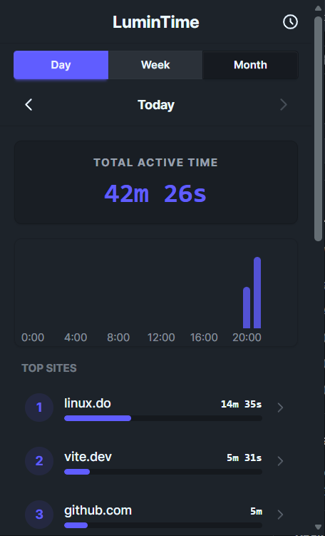
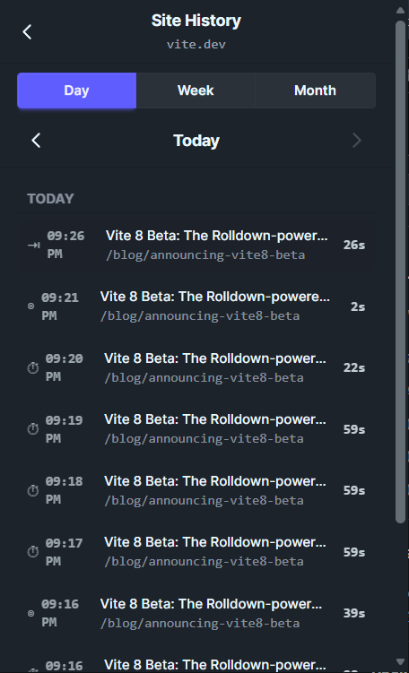

# LuminTime

A privacy-first browser extension that automatically tracks your online activity. All data stays local, no cloud, no account required.

**[Install from Chrome Web Store](https://chromewebstore.google.com/detail/lumin-time/elfkjlledpjmjehekdklejboanfbffak)**

<div style="display: flex; justify-content: center;">
   
</div>

---

## Screenshots

<div style="display: flex; justify-content: center;">
  
  
</div>

## Key Features

- **Background Session Tracking** – Monitors active tabs and captures time spent per domain and page
- **Local-First Storage** – All data stored in IndexedDB; nothing synced to the cloud
- **Privacy by Design** – No account, no authentication, no external requests
- **Time Analytics** – View daily and hourly trends with time spent per site
- **Zero Telemetry** – Complete data ownership and privacy

## Getting Started

### Prerequisites

- Node.js 18+ and Bun package manager
- A modern Chromium-based browser (Chrome, Edge, Brave, etc.)

### Installation

1. Clone the repository:

   ```bash
   git clone https://github.com/nuttycc/LuminTime.git
   cd LuminTime
   ```

2. Install dependencies:

   ```bash
   bun install
   ```

3. Start the development server:

   ```bash
   bun run dev
   ```

4. Load the extension in your browser:
   - Open `chrome://extensions/`
   - Enable "Developer mode"
   - Click "Load unpacked" and select the `.output/chrome-mv3` folder

### Project Structure

```
src/
├── entrypoints/     # Extension entry points (background, popup)
├── components/      # Vue 3 components
├── composables/     # Vue composables (hooks)
├── db/             # Database layer (Dexie models, services)
├── utils/          # Utility functions
└── styles/         # Global styles
```

## Tech Stack

### Framework & UI

- **[WXT](https://wxt.dev/)** – Modern web extension framework with HMR support
- **[Vue 3](https://vuejs.org/)** – Progressive JavaScript framework
- **[Tailwind CSS 4](https://tailwindcss.com/)** – Utility-first CSS
- **[DaisyUI 5](https://daisyui.com/)** – Tailwind components library

### Data & Storage

- **[Dexie.js](https://dexie.dev/)** – Wrapper library for IndexedDB
- **[Arktype](https://arktype.io/)** – Runtime type validation

### Development & Testing

- **[Vitest](https://vitest.dev/)** – Unit test framework
- **[VueUse](https://vueuse.org/)** – Composition utilities for Vue
- **[Es-Toolkit](https://es-toolkit.dev/)** – Modern JavaScript utilities

## How It Works

1. **Session Tracking** – Background script monitors active tabs via Browser Tabs API, detects window focus, and idle state changes
2. **Time Recording** – Captures time spent on each domain and page, split by midnight boundaries
3. **Data Storage** – Records are stored in three layers: raw history logs, site aggregates, and page details
4. **Analytics Dashboard** – Popup displays total time, daily/hourly trends, and top sites ranked by duration
5. **Privacy First** – All processing happens locally; zero cloud requests or external dependencies

## License

MIT License

## Support

For issues, feature requests, or questions, please open an issue on [GitHub](https://github.com/nuttycc/LuminTime/issues).
